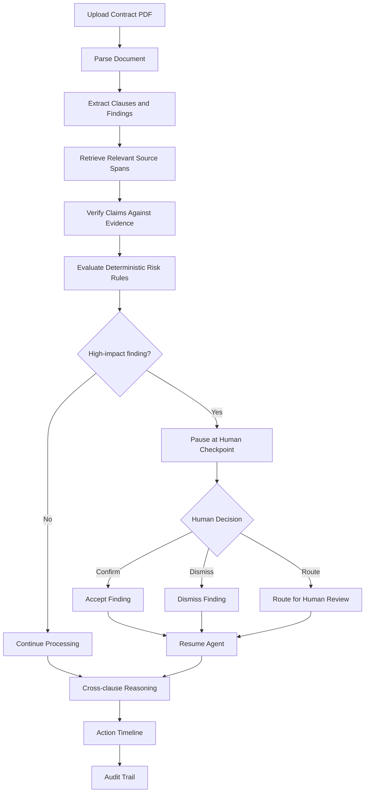
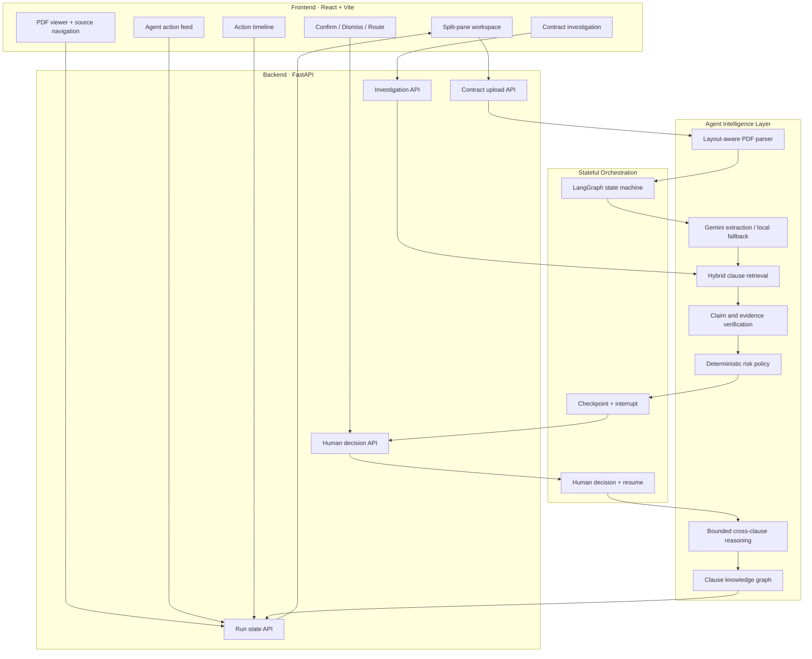
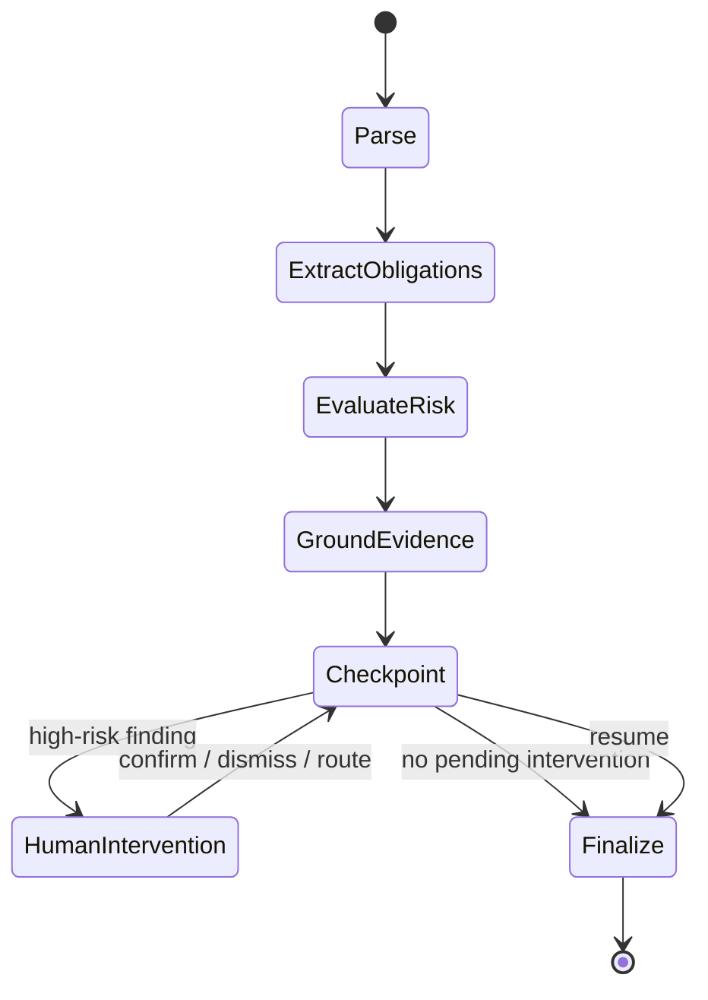
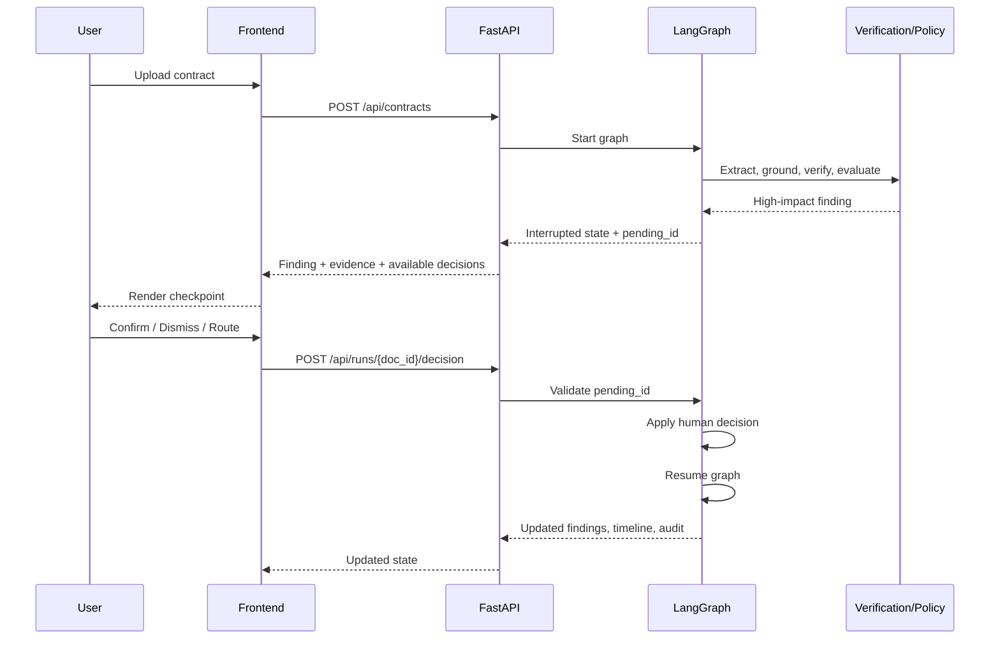
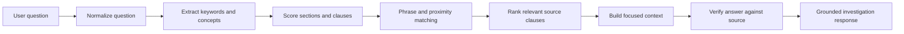
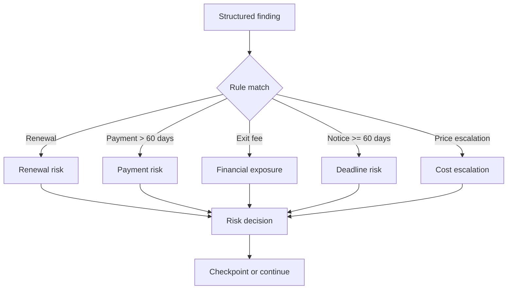
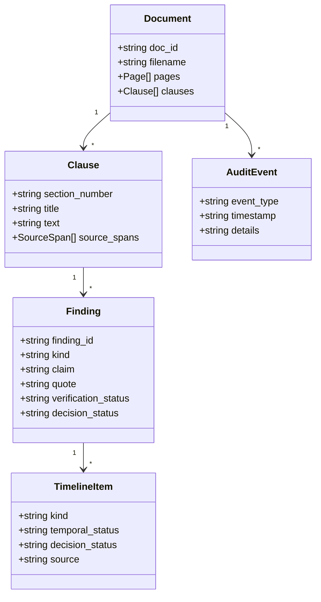

<div align="center">

# SAMVIDA

### Contract-to-Action Intelligence Agent

**Turns a business contract from a static PDF into a verifiable, source-grounded action plan — and knows when to stop, show evidence, and ask a human.**

<br/>

[](https://www.python.org/)
[](https://fastapi.tiangolo.com/)
[](https://langchain-ai.github.io/langgraph/)
[](https://react.dev/)
[](https://pymupdf.readthedocs.io/)
[](https://pytest.org/)

<br/>

**Built for Problem Statement 4 — Business Contract Review & Obligation Tracking**  
**Product Space · Agentic AI Hackathon 2026**

<br/>

[Live Agent](https://samvida-ashen.vercel.app)

</div>

---

## 01 · Product Overview

Business contracts are not just documents to summarize. They contain deadlines, obligations, renewal traps, financial exposure, notice requirements, and operational dependencies that must be converted into decisions and actions.

**SAMVIDA** is an agentic contract intelligence workspace that transforms:

```text
Contract PDF
    ↓
Structured clauses
    ↓
Evidence-grounded findings
    ↓
Risk and obligation evaluation
    ↓
Human checkpoint when required
    ↓
Action timeline + audit trail
```

Its central design principle is:

> **Controlled Autonomy — the agent should not be judged only by what it can do, but also by whether it knows when it must stop.**

SAMVIDA is intentionally designed as more than a generic **Chat with PDF** interface. It begins processing after upload, creates structured findings, links them to source evidence, evaluates risk policies, and pauses before high-impact decisions require human direction.

---

## 02 · The Problem

Important contract details are often distributed across different sections:

- Automatic or perpetual renewal
- Non-renewal notice windows
- Payment terms
- Price escalation
- Early termination fees
- Data return and deletion
- Reporting and notification obligations
- Conditions that depend on another clause

A conventional document chatbot generally waits for a user question and returns a conversational answer. That approach can miss the operational question:

> **What should happen next, by when, based on which clause, and what requires human verification?**

SAMVIDA converts contract language into a traceable operational view.

---

## 03 · What SAMVIDA Does

| Capability | What it provides |
|---|---|
| Contract ingestion | Accepts a digital, text-based PDF contract |
| Layout-aware parsing | Preserves pages, word positions, clauses, headings, and source spans |
| Structured extraction | Converts contract language into obligations, conditions, deadlines, fees, and findings |
| Source grounding | Connects each material finding to an exact quote and section |
| Evidence hierarchy | Uses exact word-level PDF highlighting where provable, otherwise page/section/excerpt evidence |
| Risk policy | Applies deterministic, inspectable rules to extracted findings |
| Human checkpoint | Pauses the workflow for high-impact findings |
| Decision handling | Supports Confirm, Dismiss, and Route for Human Review |
| Stateful resume | Resumes processing after a human decision |
| Cross-clause reasoning | Connects related clauses such as renewal, notice, and termination |
| Action timeline | Converts confirmed findings into actionable items |
| Audit trail | Tracks processing and human-decision events |
| Contract investigation | Supports evidence-backed questions over the uploaded contract |
| Local fallback | Keeps a narrower deterministic pipeline available when Gemini is unavailable |

---

## 04 · Why This Is Not Just ChatPDF

| Generic contract chatbot | SAMVIDA |
|---|---|
| Waits for a user prompt | Starts analysis after upload |
| Produces a summary or answer | Produces findings, risks, actions, and evidence |
| Source location may be vague | Uses section, page, excerpt, and visual source mapping |
| Risk is an opaque model opinion | Risk rules are deterministic and inspectable |
| No explicit stop boundary | High-risk findings can pause the workflow |
| Human feedback is conversational | Human decisions are represented in agent state |
| No reliable continuation model | LangGraph checkpoint and resume flow |
| Related clauses may remain disconnected | Bounded cross-clause relationships |
| One evidence path | Two-tier evidence model |
| API failure can stop the demo | Deterministic local fallback |
| Timeline is usually absent | Action timeline and audit trail |

The goal is not to claim that language models never make mistakes. The goal is to make important outputs **inspectable, grounded, and interruptible**.

---

## 05 · Core Product Loop



---

## 06 · High-Level Architecture



### Main layers

| Layer | Responsibility |
|---|---|
| Presentation | PDF, action feed, timeline, evidence controls, investigation input |
| API | Upload, run state, human decisions, investigation requests |
| Document model | Pages, word boxes, sections, clauses, source spans |
| Retrieval | Finds relevant clauses using deterministic lexical and structural signals |
| Extraction | Structured model output with local fallback |
| Verification | Checks claims against their own evidence |
| Policy | Applies explicit risk rules |
| Orchestration | Controls state, interruption, human input, and resume |
| Reasoning | Connects related clauses without presenting legal conclusions |
| Output | Findings, action timeline, and audit history |

---

## 07 · LangGraph State Machine

SAMVIDA uses a stateful workflow rather than a frontend-only loading animation.



The workflow is designed around a real interrupt/resume boundary:

```python
builder.compile(
    checkpointer=MemorySaver(),
    interrupt_before=["human_intervention"],
)
```

The frontend renders the checkpoint state, but the decision boundary is enforced by the backend workflow.

### Human decision lifecycle



The decision endpoint must validate that the submitted finding matches the graph's current pending finding. A stale or mismatched decision should not be silently accepted.

---

## 08 · Research-Inspired Techniques Implemented

The project prioritizes techniques that are visible in the product and useful on the real request path instead of adding decorative complexity.

| Technique | How it is used | Role |
|---|---|---|
| Layout-aware document model | Builds a document → page → section → clause → source-span hierarchy from PDF word boxes | Source structure |
| Position-based grounding | Locates quote offsets and associates them with the nearest real heading | Section correctness |
| Two-tier evidence | Tier 1: word-level rectangles; Tier 2: page + section + excerpt | Evidence reliability |
| Hybrid clause retrieval | Combines lexical overlap, section/title overlap, phrase matching, and proximity | Investigation grounding |
| Clause knowledge graph | Stores explicit source-supported relations between clauses | Cross-clause context |
| Bounded cross-clause reasoning | Connects related clauses such as renewal, notice, payment, and termination | Operational context |
| Structured claim verification | Checks quote support and number/date consistency | Hallucination resistance |
| Deterministic risk policy | Applies explicit rules rather than an unexplained model score | Decision boundary |
| Temporal/decision separation | Keeps `OVERDUE`, `DUE_SOON`, and similar temporal states separate from Confirm/Dismiss/Route | Correct status semantics |
| Stateful orchestration | Uses LangGraph checkpointing and human-controlled resume | Controlled autonomy |
| Deterministic local fallback | Provides a narrower path when the model/API is unavailable | Demo resilience |

### Important engineering principle

> **A technique is valuable only when it contributes to a visible, testable product behavior.**

SAMVIDA deliberately does not pretend to use every popular research architecture. The current design avoids decorative multi-agent theatre, unnecessary vector infrastructure, and unsupported claims of perfect accuracy.

---

## 09 · Clause Retrieval for Investigation

The investigation feature is designed to answer questions using relevant contract context instead of sending an unrelated or excessively broad text window to the model.

### Retrieval signals



The retrieval layer considers signals such as:

- Exact phrase overlap
- Important keywords
- Section number and title matches
- Related concept terms
- Clause proximity
- Connected clauses from the lightweight knowledge graph
- Renewal, notice, termination, fee, deadline, and payment relationships

For example, a question about avoiding renewal should not rely on one isolated sentence. It should retrieve the relevant renewal clause, notice requirements, and termination-cost clause together.

### Investigation response policy

1. Retrieve relevant clauses.
2. Provide focused source context.
3. Generate a structured answer where model output is available.
4. Check important claims against source text.
5. Fall back to grounded clause-based output when the model refuses or produces insufficient evidence.
6. Avoid presenting unsupported legal conclusions.

---

## 10 · Deterministic Risk Rules

SAMVIDA currently uses explicit policy rules for findings that may require human attention.

| Rule | Trigger | Product behavior |
|---|---|---|
| R1 | Automatic or perpetual renewal | Flag renewal exposure and relevant notice window |
| R2 | Payment term greater than 60 days | Flag extended payment obligation |
| R3 | Early termination fee | Flag financial exposure |
| R4 | Notice period of 60 days or more | Flag deadline-sensitive notice requirement |
| R5 | Contractual price escalation | Flag renewal-period cost change |

These are **product policy thresholds**, not universal legal standards. They are intentionally visible and inspectable so the user can understand why a finding was flagged.



---

## 11 · Evidence Model

SAMVIDA uses a two-tier evidence model.

### Tier 1 · Visual source evidence

```text
Finding
  ↓
Verbatim quote
  ↓
Character / word position mapping
  ↓
PyMuPDF word rectangles
  ↓
Visual highlight in the original PDF
```

### Tier 2 · Grounded textual evidence

When exact spatial mapping cannot be proven, SAMVIDA falls back to:

- Page number
- Section number
- Section title
- Exact excerpt
- Verification status

The system should never create fake bounding boxes simply to make the interface look complete.

| Verification state | Meaning |
|---|---|
| `SUPPORTED` | Claim is supported by the cited source |
| `PARTIALLY_SUPPORTED` | Some but not all claim components are supported |
| `INSUFFICIENT_EVIDENCE` | Available source does not establish the claim |
| `CONFLICTING_EVIDENCE` | Claim conflicts with its own cited source |

---

## 12 · Action Timeline

The timeline is not a duplicate list of extracted facts. It is intended to represent operationally useful items.

Each timeline item should answer as many of these questions as the source supports:

| Field | Meaning |
|---|---|
| What | Obligation, event, condition, or action |
| When | Date, relative deadline, timing condition, or unknown |
| Who | Responsible party when stated |
| Why | Clause-based rationale |
| Consequence | Fee, waiver, renewal, termination, or operational impact |
| Source | Section, page, excerpt, or PDF highlight |
| Status | Temporal status and decision status separately |

### Timeline semantics

| Kind | Purpose |
|---|---|
| `ACTION` | Something a party must do |
| `MILESTONE` | Important contract event |
| `CONDITION` | Event or condition that controls another obligation |
| `RELATIVE_DEADLINE` | Deadline relative to another event |
| `ALERT` | Risk or attention item |

### Status separation

Temporal status and human decision status are intentionally independent.

```text
Temporal status:
UPCOMING · DUE_SOON · OVERDUE · NOT_APPLICABLE

Decision status:
PENDING · CONFIRMED · DISMISSED · ROUTED
```

A finding can be confirmed while its deadline remains overdue. Confirming a finding does not mean the underlying obligation has been completed.

---

## 13 · Demo Contract

The repeatable demo contract is:

`Veritas_Cloud_Master_Services_Agreement.pdf`

It is a clean, digital, single-column, five-page B2B SaaS agreement selected because exact source mapping and visual evidence can be demonstrated reliably.

| Clause | Operational detail |
|---|---|
| §2.1 | Initial term ending 31 March 2027 |
| §2.2 | Successive 12-month automatic renewals and 90-day non-renewal notice |
| §2.3 | Written notice requirements; email alone is insufficient unless acknowledged |
| §3.2 | Undisputed invoices payable within 75 days |
| §3.4 | Renewal price increase with 30-day notice and a maximum 9% increase |
| §4.3 | Service-credit claims within 30 days or waiver |
| §6.1 | Annual SOC 2 Type II report due by 30 June |
| §6.2 | Incident notification within 72 hours of confirmation |
| §8.2 | Export and deletion windows after termination |
| §9.1 | 60-day termination-for-convenience notice and USD 45,000 early termination fee |
| §9.2 | Termination for uncured material breach after 30 days' written notice |

### Example investigation

```text
If Northwind wants to avoid renewal, what deadlines,
notice requirements, and termination costs should it consider?
```

The expected investigation context includes the renewal, notice, and termination clauses rather than treating each clause as an isolated fact.

---

## 14 · Frontend Experience

The interface is organized as an operational workspace rather than a chat-first product.

```text
┌───────────────────────────────────────────────────────────────┐
│ SAMVIDA · Contract name · Processing status                  │
├──────────────────────────────┬────────────────────────────────┤
│                              │ Parse → Extract → Evaluate     │
│ Original contract PDF        │ Ground → Checkpoint → Resume   │
│                              │                                │
│ Source highlighting         │ Agent action feed              │
│ Page navigation             │ Evidence + decisions           │
│                              │ Investigation utility          │
├──────────────────────────────┴────────────────────────────────┤
│ Action timeline · tracked findings · temporal status         │
└───────────────────────────────────────────────────────────────┘
```

### Primary surfaces

- Original PDF viewer
- Agent processing stages
- Action feed
- Evidence and source navigation
- Human checkpoint controls
- Contract investigation utility
- Action timeline
- Audit trail
- Horizontal timeline exploration for multiple findings

The investigation utility is deliberately secondary. The hero experience is the agent's ability to convert a contract into a grounded action plan and stop at a defined decision boundary.

---

## 15 · API Surface

| Method | Endpoint | Purpose |
|---|---|---|
| `GET` | `/api/health` | Returns model/key and service status |
| `POST` | `/api/contracts` | Uploads a contract and starts processing |
| `GET` | `/api/runs/{doc_id}` | Returns current state, findings, timeline, graph, and audit data |
| `POST` | `/api/runs/{doc_id}/decision` | Applies Confirm, Dismiss, or Route and resumes the graph |
| `POST` | `/api/contracts/{doc_id}/ask` | Investigates the uploaded contract using grounded context |

### Core state objects



---

## 16 · Repository Structure

The repository is organized around the separation between document processing, agent orchestration, API routes, and frontend presentation.

```text
.
├── backend/
│   ├── app/
│   │   ├── main.py              # FastAPI routes and application wiring
│   │   ├── graph.py             # LangGraph orchestration and checkpoints
│   │   ├── extract.py           # Extraction and investigation grounding
│   │   ├── retrieval.py         # Clause-level retrieval
│   │   ├── knowledge_graph.py   # Source-supported clause relations
│   │   ├── reasoning.py         # Bounded cross-clause reasoning
│   │   ├── verification.py      # Claim/source verification
│   │   ├── local_extract.py     # Deterministic fallback path
│   │   ├── risk.py              # Deterministic risk rules
│   │   ├── timeline.py          # Timeline generation and status logic
│   │   └── ...
│   ├── tests/
│   ├── requirements.txt
│   ├── requirements-dev.txt
│   └── Dockerfile
├── frontend/
│   ├── src/
│   │   ├── App.jsx
│   │   ├── components/
│   │   ├── Rails.jsx
│   │   ├── IntroSplash.jsx
│   │   └── ...
│   ├── package.json
│   └── vite.config.*
├── test_images/
├── setup-windows.ps1
└── README.md
```

> File names can evolve as the implementation changes. The architectural separation is the important design boundary: parsing, retrieval, verification, policy, orchestration, and presentation should not be mixed into one untestable component.

---

## 17 · Quickstart

### Backend

```bash
cd backend

python -m venv .venv

# macOS / Linux
source .venv/bin/activate

# Windows PowerShell
.\.venv\Scripts\Activate.ps1

pip install --upgrade pip
pip install -r requirements.txt

cp .env.example .env
# Add GEMINI_API_KEY when using Gemini
# Or set CONTRACTLENS_OFFLINE=1 for local fallback

uvicorn app.main:app --reload --port 8000
```

### Frontend

Open a second terminal:

```bash
cd frontend
npm install
npm run dev
```

Open:

```text
http://localhost:5173
```

### Windows setup script

```powershell
powershell -ExecutionPolicy Bypass -File .\setup-windows.ps1
```

### Docker

```bash
docker build -t samvida-backend ./backend
docker run -p 8000:8000 --env-file backend/.env samvida-backend
```

### Python interpreter note

For VS Code, select the project virtual environment:

```text
backend\.venv\Scripts\python.exe
```

This prevents Pylance from checking the project against a different global Python installation.

---

## 18 · Testing and Validation

Run:

```bash
cd backend
pip install -r requirements-dev.txt
pytest -v
```

The test suite is intended to validate behavior, not just HTTP status codes.

Representative checks include:

| Test area | What it protects |
|---|---|
| Section grounding | Payment Terms resolves to §3.2 instead of the wrong heading |
| Exact fee extraction | USD 45,000 is preserved |
| Number conflict detection | Incorrect claims are marked as conflicting evidence |
| Temporal status | Payment and deadline states are not replaced by confirmation status |
| Knowledge graph | Source-supported relations are created |
| Cross-clause reasoning | Related clauses can be connected |
| Local fallback | Core demo flow remains usable without the model |
| Investigation retrieval | Questions retrieve related clauses instead of unrelated context |

Before a demo, verify:

- Backend health endpoint responds.
- Contract upload completes.
- Findings contain section and source information.
- The intended high-risk checkpoint appears.
- Confirm/Dismiss/Route changes the backend state.
- The graph resumes after a decision.
- Timeline items are created.
- Investigation answers use the relevant clauses.
- The deployed frontend points to the correct backend URL.
- Environment variables are configured in the deployment platform.

---

## 19 · Deployment Notes

### Frontend

The frontend can be deployed through Vercel using the frontend project directory and its configured build command.

### Backend

The backend can be deployed as a FastAPI-compatible Vercel service or another Python hosting target, provided:

- The correct entrypoint is configured.
- Required environment variables are present.
- The frontend uses the deployed backend URL.
- CORS allows the deployed frontend origin.
- The deployment is tested using the production URL rather than only localhost.

### Redeployment checklist

1. Push the intended commit to the connected branch.
2. Confirm the deployment is using the correct project and root directory.
3. Redeploy without an old build cache when debugging stale behavior.
4. Check runtime logs for the exact API request.
5. Test `/api/health`.
6. Upload the demo PDF.
7. Test the investigation feature with a specific clause-grounded question.
8. Confirm that the frontend and backend deployments are from compatible versions.

---

## 20 · Scope and Honest Limitations

SAMVIDA is a hackathon-focused vertical slice, not a complete enterprise contract management platform.

### Current scope

- Digital, text-based B2B PDF contracts
- English-language contract text
- Evidence-grounded extraction and investigation
- Deterministic risk policies
- Stateful human checkpoint and resume
- In-memory run state for the current session
- Local fallback for a narrower offline flow

### Intentionally out of scope

- OCR for scanned documents and photographs
- Enterprise authentication and multi-tenant permissions
- Persistent production database
- Complete legal review or legal advice
- Automatic execution of legally binding actions
- Universal legal risk scoring
- Guaranteed zero hallucinations
- Full production-grade document lifecycle management

The system supports contract review and operational tracking. It does not replace legal judgment.

---

## 21 · Security and Trust Considerations

SAMVIDA is designed around inspectability:

- Findings should retain source references.
- Human decisions should be explicit.
- Stale or mismatched decision IDs should be rejected.
- Model output should not be treated as authoritative without verification.
- Policy thresholds should be visible and configurable.
- Production deployments should use proper authentication, authorization, secret management, logging, and data retention controls.
- Demo credentials, if used, should be disabled after evaluation.

The product's trust model is based on **evidence, bounded autonomy, and human control**, not on claiming that the model is infallible.

---

## 22 · Product Walkthrough

A compact demo flow:


Suggested demonstration sequence:

1. Upload the Veritas Cloud agreement.
2. Show the processing stages.
3. Open a finding and show its section, page, and exact excerpt.
4. Show why a risk policy fired.
5. Demonstrate the checkpoint.
6. Confirm or route the finding.
7. Show the resumed state and action timeline.
8. Ask a specific investigation question involving renewal, notice, and termination cost.
9. Open the source evidence returned with the answer.

---

## 23 · Design Principles

### 1. Evidence before confidence

A confident answer without a source is not enough.

### 2. Stop before unsafe autonomy

A useful agent must know when a human decision is needed.

### 3. Deterministic boundaries around probabilistic output

The model can help extract and interpret. Policies and verification constrain what happens next.

### 4. Temporal state is not decision state

Confirming a finding does not mean its deadline has been satisfied.

### 5. Graceful degradation

When model access fails, a narrower deterministic fallback is better than an opaque failure.

### 6. Honest scope

The project favors a smaller, demonstrable, testable system over a larger architecture that cannot be verified.

---

## 24 · Roadmap

| Area | Future direction |
|---|---|
| Document coverage | OCR and scanned PDF support |
| Persistence | Database-backed runs and audit history |
| Security | Authentication, authorization, tenant isolation |
| Retrieval | Optional embeddings and reranking evaluation |
| Evidence | More robust table and multi-column extraction |
| Workflow | Configurable policy packs per organization |
| Collaboration | Review assignments and comments |
| Integrations | Calendar, email, ticketing, and document systems |
| Evaluation | Larger benchmark set with retrieval, grounding, and decision-quality metrics |
| Governance | Model/version traceability and retention policies |

---

## 25 · Final Positioning

SAMVIDA is built around one question:

> **Can an AI agent turn contract language into verifiable operational action without crossing a decision boundary silently?**

Its answer is a workflow that connects:

```text
Evidence
   ↓
Risk
   ↓
Human decision
   ↓
Resumption
   ↓
Action plan
   ↓
Auditability
```

**Not an AI that simply does more.  
An AI whose autonomy has engineered boundaries.**

---

<div align="center">

### SAMVIDA

**Contract → Evidence → Decision → Action**

<br/>

#AIHackathon #BuildWithAI #ProductSpace #AgenticAI #AIEngineering #HumanInTheLoop #ContractIntelligence #SAMVIDA #CODERUDRAX

</div>
